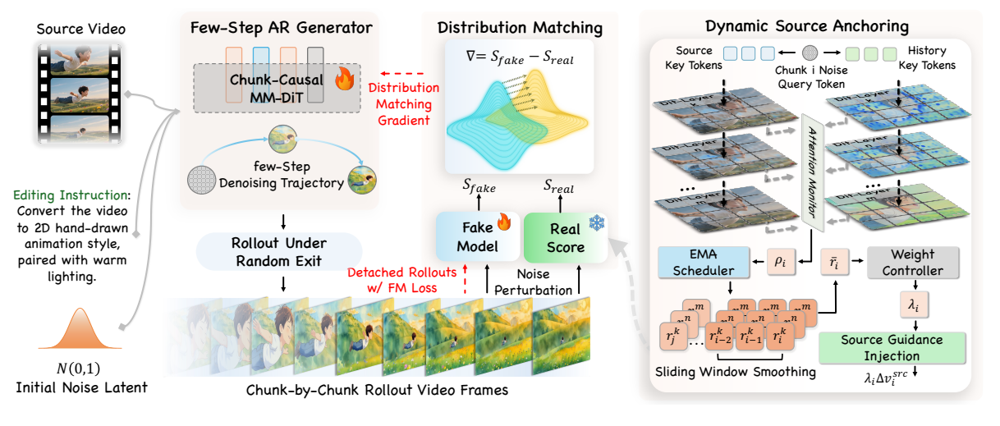

# Training & Evaluation

This directory provides autoregressive adaptation, Resilient-DMD distillation, long-horizon fine-tuning, and evaluation on LongV2VBench and OpenVE-Bench for JoyAI-Video-Edit.

Follow the [main README](../README.md#quick-start) to set up the environment and prepare model weights. Activate that environment, then enter `training/` from the repository root. Run all commands below from this directory:

```bash
cd training
```

## Method Overview



**Resilient-DMD** monitors relative source attention to detect overreliance on generated history. When source grounding weakens, it strengthens the real-score teacher's source guidance and trains a two-step generator through distribution matching. The generator and fake-score model share a backbone with separate LoRA adapters; monitoring and control are active only during training.

**Long-Horizon Autoregressive Distillation (LHAD)** extends training to longer rollouts using forward–reverse traversal of source videos, segmented backpropagation, and detached history reuse, keeping activation memory bounded.

## 1. Training Data

Download [JoyAI-Video-Edit ToyData](https://huggingface.co/datasets/EasonXiao-888/JoyAI-Video-Edit_ToyData):

```bash
hf download EasonXiao-888/JoyAI-Video-Edit_ToyData \
    --repo-type dataset --local-dir data
```

Keep the TAR files intact; no extraction is needed. Convert `resolved_files` in the four manifests to local absolute paths:

```bash
python - <<'PY'
import json
from pathlib import Path

root = Path("data").resolve()
for task in ("t2i", "i2i", "t2v", "v2v"):
    manifest_path = root / f"{task}.json"
    manifest = json.loads(manifest_path.read_text(encoding="utf-8"))
    shards = [root / Path(shard).name for shard in manifest["resolved_files"]]
    missing = [str(shard) for shard in shards if not shard.is_file()]
    if missing:
        raise FileNotFoundError(f"Missing TAR files: {missing}")
    manifest["resolved_files"] = [str(shard) for shard in shards]
    manifest_path.write_text(json.dumps(manifest, indent=2) + "\n", encoding="utf-8")
PY
```

The default configs use `data/t2i.json`, `data/i2i.json`, `data/t2v.json`, and `data/v2v.json`, with `caption` as the text field. Override these paths with `JOYAI_T2I_DATA`, `JOYAI_I2I_DATA`, `JOYAI_T2V_DATA`, and `JOYAI_V2V_DATA` if needed.

> ToyData is intended for data-loading checks and training smoke tests, not full-scale training.

## 2. Training

Set the model paths for your machine. Compatible weights prepared for the main repository can be reused:

```bash
export JOYAI_BASE_MODEL="/absolute/path/to/base_model.pth"
export JOYAI_VAE="/absolute/path/to/vae"
export JOYAI_TEXT_ENCODER="/absolute/path/to/text_encoder"
```

### Configure Your Experiment

| Config | Purpose |
| --- | --- |
| `configs/stage1_ar.py` | Stage1 autoregressive adaptation |
| `configs/stage2_distillation.py` | Stage2 Resilient-DMD distillation |
| `configs/stage2_distillation_long-tuning.py` | LHAD fine-tuning from a Stage2 checkpoint |

For an initial smoke test, adjust the relevant config as follows:

| Setting | Example |
| --- | --- |
| Experiment and steps | `exp_name="toy"`, `max_train_steps=20`, `checkpoint_interval=10`, `lr_warmup_steps=5` |
| Resolution and length | `TRAIN_RESOLUTION=(480, 832)`; set both bucket limits, `min_temporal` and `max_temporal`, to `49` |
| Batch size | Keep `micro_batch_size=1` and all bucket `bs_*` values at `1`; increase `gradient_accumulation_steps` as needed |
| Learning rate | Set `learning_rate` for Stage1; set `dmd_generator_learning_rate` and `dmd_fake_score_learning_rate` separately for Stage2 |
| Task mixture | Adjust `image_sampling_prob`, `multiple_images_sampling_prob`, `video_sampling_prob`, and `multiple_videos_sampling_prob`; use `0, 0, 1, 0` for T2V only |
| Long-horizon training | `dmd_rollout_num_chunks` controls generator rollout length, `dmd_grad_window_chunks` controls segment length, and `dmd_critic_rollout_num_chunks` controls critic rollout length independently |

Keep V2V sampling enabled to test dynamic source guidance. Single-GPU training requires sufficient VRAM; for multi-GPU training, configure `hsdp_shard_dim` and `sp_size` rather than only increasing the process count.

### Stage1 → Stage2

The following example runs Stage1 with `exp_name="toy"`, one GPU, and 20 training steps:

```bash
bash scripts/train/stage1_ar.sh configs/stage1_ar.py 1
```

Initialize distillation from the Stage1 checkpoint:

```bash
export JOYAI_STAGE1_CKPT="$PWD/outputs/stage1_ar/toy_sp1_world1/checkpoints/global_step20/step_20.pth"
bash scripts/train/stage2_distillation.sh configs/stage2_distillation.py 1
```

The final `1` specifies the number of GPU processes per node. Logs and checkpoints are saved under `outputs/<stage>/<exp_name>_sp<sp_size>_world<world_size>/`. Set `JOYAI_OUTPUT_DIR` to override the output root.

### Long-Horizon Fine-Tuning

```bash
export JOYAI_STAGE2_CKPT="$PWD/outputs/stage2_distillation/toy_sp1_world1/checkpoints/global_step20/step_20.pth"
JOYAI_OUTPUT_DIR=outputs/stage2_longtuning \
    bash scripts/train/stage2_distillation.sh configs/stage2_distillation_long-tuning.py 1
```

Set `max_train_steps` in the long-horizon config above the resumed checkpoint's step. **Stage2 / LHAD LoRA checkpoints do not include the full backbone. Keep the same `JOYAI_STAGE1_CKPT` for continued training and evaluation.**

## 3. Evaluation

### Download the Benchmarks

**LongV2VBench**: [EasonXiao-888/LongV2VBench](https://huggingface.co/datasets/EasonXiao-888/LongV2VBench).

```bash
hf download EasonXiao-888/LongV2VBench \
    --repo-type dataset --local-dir data/LongV2VBench
```

**OpenVE-Bench**: use the [OpenVE-Bench dataset](https://huggingface.co/datasets/Lewandofski/OpenVE-Bench) provided by the [official OpenVE-3M project](https://github.com/OpenVE-Team/OpenVE-3M).

```bash
hf download Lewandofski/OpenVE-Bench \
    --repo-type dataset --local-dir data/OpenVE-Bench
```

If the data is distributed as an archive, extract it following the dataset instructions. Each benchmark uses `benchmark_videos.csv` in its data directory. Preserve the video directory structure so that `original_video` paths resolve correctly. For custom locations, set `DATASET_ROOT` and either `METADATA_PATH` for LongV2VBench or `CSV_PATH` for OpenVE-Bench.

### Generate Videos

Specify the `.pth` checkpoint to evaluate, using the matching config, Stage1 backbone, VAE, and text encoder:

```bash
export JOYAI_CHECKPOINT="/absolute/path/to/stage2/step_XXXX.pth"

GPUS_PER_NODE=1 SAVE=outputs_eval/longv2vbench \
    bash scripts/evaluation/longv2vbench.sh \
    configs/stage2_distillation.py "$JOYAI_CHECKPOINT"

GPUS_PER_NODE=1 SAVE=outputs_eval/openvebench \
    bash scripts/evaluation/openvebench.sh \
    configs/stage2_distillation.py "$JOYAI_CHECKPOINT"
```

Override inference settings with `INFERENCE_STEP`, `CFG`, `SRC_CFG`, and `RESOLUTION`, or append `--max-items 1` for a single-sample check. Results are written to `SAVE/fullset/<edited_type>/`. Existing videos are skipped, so use a new `SAVE` directory when changing models or settings.

### Evaluation

The commands above generate videos without scoring by default. To enable scoring, configure a Gemini-compatible gateway that supports video requests:

```bash
export GEMINI_API_KEY="YOUR_API_KEY"
export GEMINI_BASE_URL="https://YOUR_VIDEO_CAPABLE_GATEWAY/v1"
export MODEL_ID="Gemini-2.5-pro"
```

Prefix either evaluation command with `RUN_EVAL=True MAX_WORKERS=4` to score videos after inference. LongV2VBench saves JSONL results and a TXT summary; OpenVE-Bench saves CSV results and JSON statistics, all under the corresponding `SAVE` directory.

Scoring uploads videos and may incur API charges. Video generation alone does not require an API key.

## Acknowledgements

We thank the authors and contributors of the following projects for sharing their open-source work:

- [LongLive](https://github.com/NVlabs/LongLive)
- [Self Forcing](https://github.com/guandeh17/Self-Forcing)
- [Causal Forcing](https://github.com/thu-ml/Causal-Forcing)

## Citation

If you find this project helpful, please cite:

```bibtex
@article{xiao2026joyai,
  title={JoyAI-Video-Edit: Real-Time Open-Ended Video Editing with Autoregressive Diffusion},
  author={Xiao, Yicheng and Dai, Wenxun and Qin, Xinran and Song, Lin and Zhang, Maoquan and Xu, Hang and Chen, Yukang and Li, Yitong and Zhang, Guohui and Zhang, Yuan and Zhang, Xuying and Zhang, Tommy and Yuan, Jianlong and Li, Peihao and Lu, Shuai and Fu, Siming and Zhao, Chuyang and Han, Xin and Huang, Jie and Li, Wenbo and Ma, Guoqing and Huang, Wei and Qi, Xiaojuan and Huang, Haoyang and Duan, Nan},
  journal={arXiv preprint arXiv:2608.03974},
  year={2026}
}
```
